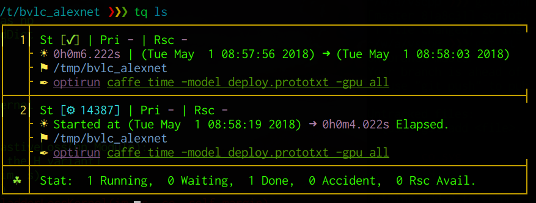

TQ -- Simple Command Line Job Manager
===

[](https://pypi.python.org/pypi/tq1/)



#### Description in English:

TQ (Task Queue) is a simple Command Line Job Manager. In principle TQ is
a very flexible and smart atd(8), which could arrange a series of jobs in
an efficient way.

(1) By default TQ will run the jobs one by one in the FIFO order.

(2) A job with high priority will be processed earlier.

(3) Given the estimated occupancy coefficient, jobs can be executed in
    parallel as long as possible.

The management of job queue is based on SQLite3 database, in which
information about every job, including the start and end time, is stored.

#### 中文描述(Description in Chinese):

在一位大佬的怂恿下，我把自己炼丹用的队列管理器tq传到了pypi上。
tq本质上就是一个异常灵活的atd，可以用来安排执行一系列耗时的命令。
默认情况下tq会串行（FIFO）执行给定的任务队列。如果指定了优先级
或者预计资源占用比，tq还能根据情况优先执行高优先任务，或者并行
执行若干非独占的任务。队列的管理依赖于SQLite3数据库，每一个任务
的各类信息，包括起止时间，都会被记录在其中。

## Install

This tool is available via PIP: `pip3 install tq1`

## Usage

```
Usage: tq ACTION [COMMAND_ARGS]
       tq [P R] -- TASK

Available Actions:
    start      start TQ's daemon
    stop       stop TQ's daemon
    log        dump log to screen
    ls         fancy print of task queue
    db         print database content to screen
    rm <ID>    remove task with specified id, see ID with tq ls
    clean      remove finished tasks from queue
    purge      remove log file and sqlite3 db file

Apending Task:
    -- TASK        append TASK to the queue
    p<P> -- TASK   append TASK with priority P to the queue
    r<R> -- TASK   append TASK with resource occupancy R to the queue
    P R -- TASK    append TASK with priority P and estimated occupancy R
                   int P default  0 range [INT_MIN, INT_MAX], large=important
                   int R detault 10 range [1,       10],      large=consuming
```

## Examples

```
0. Daemon: to start or stop the daemon
     tq start
     tq stop
1. Serial: the two given tasks should be executed one by one
     tq -- sleep 100
     tq -- sleep 100
2. Parallel: each task occupies 40% of resource.
   In this example two tasks will be active at the same time.
     tq r4 -- sleep 100
     tq r4 -- sleep 100
     tq r4 -- sleep 100
3. Priority: break the FIFO order of tasks. 1 > default Priority.
     tq p1 -- sleep 100
4. Special Case: run the given task right away ignoring Pri and Rsc
     tq 1 0 -- sleep 100
```
